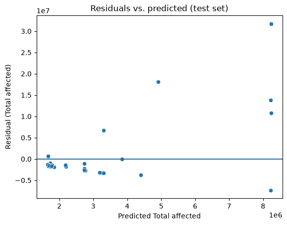

# Project Documentation

This site provides project documentation.
Use the documentation navigation to explore.

## How-To Guide

Many instructions are common to all our projects.

See
[⭐ **Workflow: Apply Example**](https://denisecase.github.io/pro-analytics-02/workflow-b-apply-example-project/)
to get the example projects running on your machine.

## Project Documentation Pages (docs/)

- **Home** - this documentation landing page
- [**Project Instructions**](./project-instructions.md)  - the standard project workflow
- [**Your Files**](./your-files.md) - how to copy the example and create your version
- [**Glossary**](./glossary.md) - project terms and concepts
- [**API**](./api.md) - autogenerated code documentation for the public project interface

## Phase 4. Technical Modification

The technical modification changed `RANDOM_STATE` in the original penguin
example from 42 to 24. The dataset, feature, target, 80/20 test size, linear
regression model, and evaluation code were unchanged.

The random state controls which records are assigned to the training and test
sets. The executed notebook confirms that the modified code completed the
273-record training split and 69-record test split, fitted the line
`body_mass_g = 49.7971 * flipper_length_mm - 5807.62`, and evaluated it on the
held-out records. The resulting test R-squared was 0.7855 and the test RMSE was
374.421 grams. Changing the seed preserves the split sizes and workflow while
changing the reproducible assignment of individual records.

## Phase 5. Custom Project

### Basis and Data

The starting example uses Seaborn's built-in `penguins` dataset. It contains
344 rows and 7 columns, with 342 complete rows used to model body mass from
flipper length.

The custom project reads
`data/raw/global_extreme_weather_socioeconomic_2015_2025.csv`, a local CSV
containing 162 global extreme-weather event records and 26 columns. All 162
records contain values for the selected feature and target, so none were
removed before modeling. Event duration ranges from 1 to 366 days, and
`total_affected` ranges from 0 to 45,000,000 people. The notebook and
repository identify the local file but do not record its original external
publisher or download source.

### Modeling Approach

This is supervised learning because the model is trained with a known target
value for every event. It is a regression task because `total_affected` is a
numeric quantity rather than a category. The custom notebook uses univariate
linear regression to fit a straight-line relationship between event duration
and the number of people affected.

The data was divided into 129 training records and 33 test records with an
80/20 split and random state 42. The fitted equation was
`total_affected = 18035.8 * duration_days + 1,638,410`. The notebook also fitted
polynomials of degrees 1 through 10 to compare training and test error as model
complexity increased.

### Target

The example target is `body_mass_g`, a continuous measurement of penguin body
mass in grams. The custom target is `total_affected`, a numeric count of people
affected by a weather event. Both targets use regression, but the fitted values,
residuals, and RMSE in the custom project are interpreted as numbers of people
rather than grams.

### Features

The example uses `flipper_length_mm` as its single predictor. The custom project
replaces it with `duration_days`, the length of a weather event in days. The
model does not use the CSV's other 24 columns, which include dates, locations,
disaster categories, severity, deaths, displacement, economic measures, and
country-level indicators.

### Evaluation and Results

The straight-line model was evaluated on the 33 held-out test records using
R-squared, RMSE, and a residual plot. Its test R-squared was 0.2836, meaning the
model accounted for 28.36% of the variation in the held-out target values. Its
test RMSE was 7,522,560 people. The residual plot contains several large
positive and negative errors rather than a narrow, uniform band around zero.

The polynomial comparison used train and test RMSE for degrees 1 through 10.
The lowest test RMSE in that sweep was 6,792,120 people at degree 6, compared
with 7,522,560 at degree 1. From degree 7 onward, test RMSE increased rapidly
to 30,389,400 at degree 7 and 3,630,810,000 at degree 10, while training RMSE
continued to decrease slightly. This divergence is evidence of overfitting at
the higher degrees.

The results are limited by the small 33-record test set, the use of only one
predictor, the wide 0-to-45-million target range, and the influence of events
with very large residuals. The missing external provenance also limits
independent assessment of how the data and target were constructed.

### Summary

The custom project loads weather-event data from CSV, selects event duration as
a numeric predictor and total affected as a numeric target, creates a
reproducible train/test split, fits a linear regression model, and evaluates
held-out predictions. The straight-line model produced a test R-squared of
0.2836 and an RMSE of approximately 7.52 million people. A polynomial sweep
reduced test RMSE to approximately 6.79 million at degree 6, followed by
rapidly increasing test error at higher degrees.

The notebook applies the project's core skills of preparing regression data,
fitting and interpreting a line, evaluating R-squared and RMSE, inspecting
residuals, and comparing training and test error across model complexities.

